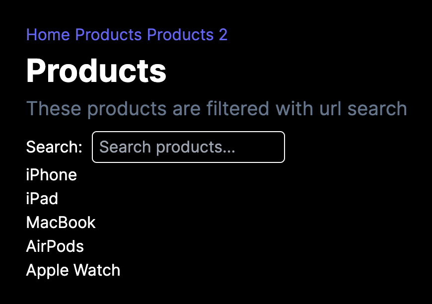

# React URL State Management

This is a simple react app that shows how to use the browser URL to manage state.

> Note: The react app is built with Next.js App Router, the same approach can be used with React Router.

## Demo

- [Live Demo](https://react-url-state-management.vercel.app)

#### Screenshot



## How to run

- Clone the repo, then run the following commands in the root directory

```bash
npm i
npm run dev
```

- open `http://localhost:3000` in your browser

## How it works

The app allows you to open two routes:

- `/products` - Filter a list of products using URL search parameter
- `/products-2` - Filter a list of products using useState hook

> Both approaches have the same functionality, but the first one uses the URL to manage the state, while the second one uses the useState hook

## Resources

- [Next.js App Router](https://nextjs.org/docs/getting-started/installation)
- [Next.js useSearchParams](https://nextjs.org/docs/app/api-reference/functions/use-search-params)
- [React Router](https://reactrouter.com/en/main)

## License

- [MIT](LICENSE.md)
